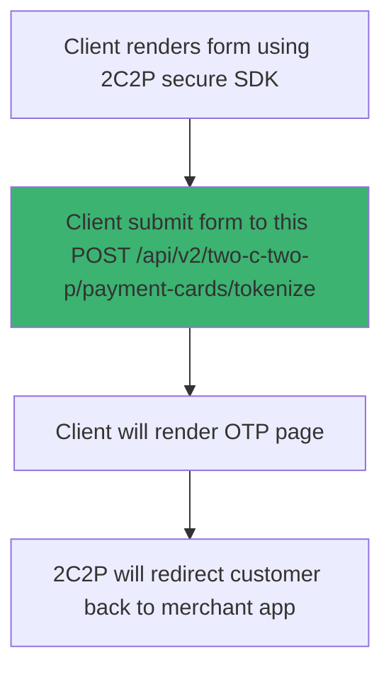

# 2C2P Card Tokenization Flow

```mermaid
---
title:
---
flowchart TB;
    style E fill:#3cb371
    C[Client renders form using 2C2P secure SDK];
    C-->E[Client submit form to this POST /api/v2/two-c-two-p/payment-cards/tokenize];
    E-->G[Client will render OTP page];
    G-->H[2C2P will redirect customer back to merchant app];
```
