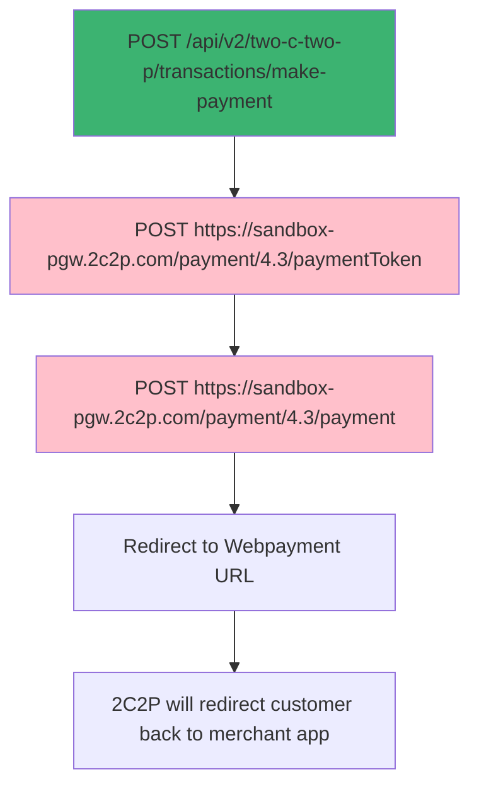

# 2C2P Subsequent Payment (Non-3DS)

```mermaid
---
title:
---
flowchart TB;
    style A fill:#3cb371
    style B fill:#ffc0cb
    style C fill:#ffc0cb
    A[POST /api/v2/two-c-two-p/transactions/make-payment];
    A-->B[POST https://sandbox-pgw.2c2p.com/payment/4.3/paymentToken]
    B-->C[POST https://sandbox-pgw.2c2p.com/payment/4.3/payment];
    C-->D[Redirect to Webpayment URL];
    D-->E[2C2P will redirect customer back to merchant app];
```
