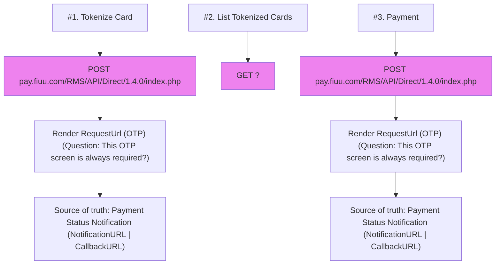

# FIUU PAYMENT FLOW

```mermaid
---
title:
---
flowchart TB;
    style B1 fill:#ee82ee
    style Y fill:#ee82ee
    style H fill:#ee82ee
    A["#1. Tokenize Card"]-->B1["POST pay.fiuu.com/RMS/API/Direct/1.4.0/index.php"];
    B1-->F3["Render RequestUrl (OTP) (Question: This OTP screen is always required?)"];
    F3-->F4["Source of truth: Payment Status Notification (NotificationURL | CallbackURL)"];
    X["#2. List Tokenized Cards"]-->Y[GET ?];
    C["#3. Payment"]-->H["POST pay.fiuu.com/RMS/API/Direct/1.4.0/index.php"];
    H-->I["Render RequestUrl (OTP) (Question: This OTP screen is always required?)"];
    I-->J["Source of truth: Payment Status Notification (NotificationURL | CallbackURL)"]
```
