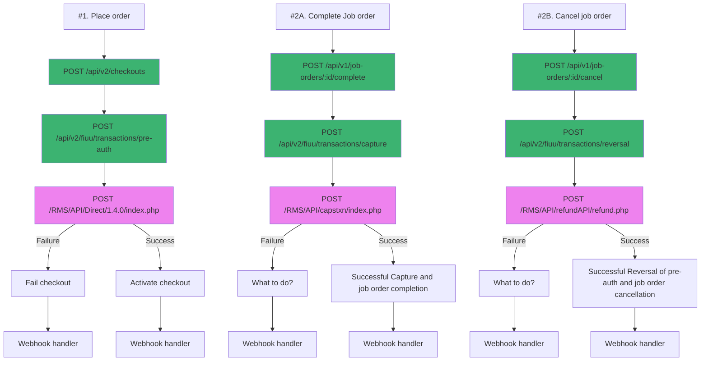
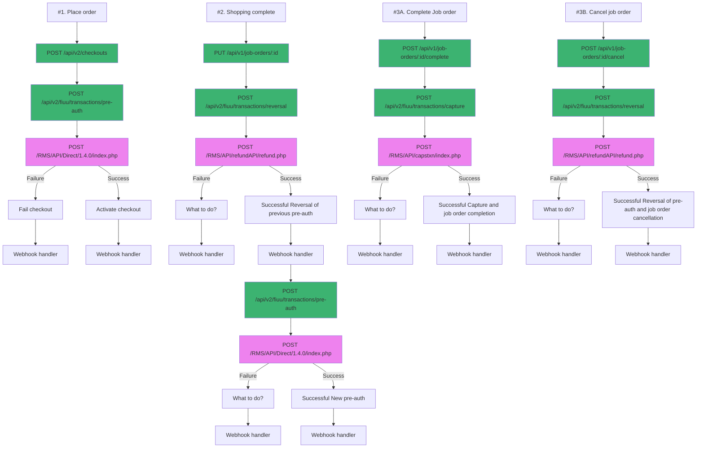

# Scenario 1: Normal pre-auth/capture

```mermaid
---
title:
---
flowchart TB;
    style B1 fill:#3cb371
    style C1 fill:#3cb371
    style D1 fill:#ee82ee

    style B2 fill:#3cb371
    style C2 fill:#3cb371
    style D2 fill:#ee82ee

    style B3 fill:#3cb371
    style C3 fill:#3cb371
    style D3 fill:#ee82ee

    A1["#1. Place order"]-->B1[POST /api/v2/checkouts];
    B1-->C1[POST /api/v2/fiuu/transactions/pre-auth];
    C1-->D1[POST /RMS/API/Direct/1.4.0/index.php];
    D1--Failure-->D11[Fail checkout];
    D1--Success-->D12[Activate checkout];
    D11-->D111[Webhook handler];
    D12-->D121[Webhook handler];

    A2["#2A. Complete Job order"]-->B2[POST /api/v1/job-orders/:id/complete];
    B2-->C2[POST /api/v2/fiuu/transactions/capture];
    C2-->D2[POST /RMS/API/capstxn/index.php];
    D2--Failure-->E2[What to do?];
    D2--Success-->F2[Successful Capture and job order completion];
    E2-->E21[Webhook handler];
    F2-->F21[Webhook handler];

    A3["#2B. Cancel job order"]-->B3[POST /api/v1/job-orders/:id/cancel];
    B3-->C3[POST /api/v2/fiuu/transactions/reversal];
    C3-->D3[POST /RMS/API/refundAPI/refund.php];
    D3--Failure-->E3[What to do?];
    D3--Success-->F3[Successful Reversal of pre-auth and job order cancellation];
    E3-->E31[Webhook handler];
    F3-->F31[Webhook handler];
```

# Scenario 2: Pre-auth amount > Capture amount

```mermaid
---
title:
---
flowchart TB;
    style B1 fill:#3cb371
    style C1 fill:#3cb371
    style D1 fill:#ee82ee

    style B2 fill:#3cb371
    style C2 fill:#3cb371
    style D2 fill:#ee82ee

    style B3 fill:#3cb371
    style C3 fill:#3cb371
    style D3 fill:#ee82ee

    A1["#1. Place order"]-->B1[POST /api/v2/checkouts];
    B1-->C1[POST /api/v2/fiuu/transactions/pre-auth];
    C1-->D1[POST /RMS/API/Direct/1.4.0/index.php];
    D1--Failure-->D11[Fail checkout];
    D1--Success-->D12[Activate checkout];
    D11-->D111[Webhook handler];
    D12-->D121[Webhook handler];

    A2["#2A. Complete Job order"]-->B2[POST /api/v1/job-orders/:id/complete];
    B2-->C2[POST /api/v2/fiuu/transactions/capture];
    C2-->D2[POST /RMS/API/capstxn/index.php];
    D2--Failure-->E2[What to do?];
    D2--Success-->F2[Successful Capture and job order completion];
    E2-->E21[Webhook handler];
    F2-->F21[Webhook handler];

    A3["#2B. Cancel job order"]-->B3[POST /api/v1/job-orders/:id/cancel];
    B3-->C3[POST /api/v2/fiuu/transactions/reversal];
    C3-->D3[POST /RMS/API/refundAPI/refund.php];
    D3--Failure-->E3[What to do?];
    D3--Success-->F3[Successful Reversal of pre-auth and job order cancellation];
    E3-->E31[Webhook handler];
    F3-->F31[Webhook handler];
```

# Scenario 3: Pre-auth amount < Capture amount (Exceeded amount)

```mermaid
---
title:
---
flowchart TB;
    style B1 fill:#3cb371
    style C1 fill:#3cb371
    style D1 fill:#ee82ee

    style B2 fill:#3cb371
    style C2 fill:#3cb371
    style D2 fill:#ee82ee
    style F22 fill:#3cb371
    style F23 fill:#ee82ee

    style B3 fill:#3cb371
    style C3 fill:#3cb371
    style D3 fill:#ee82ee

    style B4 fill:#3cb371
    style C4 fill:#3cb371
    style D4 fill:#ee82ee

    A1["#1. Place order"]-->B1[POST /api/v2/checkouts];
    B1-->C1[POST /api/v2/fiuu/transactions/pre-auth];
    C1-->D1[POST /RMS/API/Direct/1.4.0/index.php];
    D1--Failure-->D11[Fail checkout];
    D1--Success-->D12[Activate checkout];
    D11-->D111[Webhook handler];
    D12-->D121[Webhook handler];

    A2["#2. Shopping complete"]-->B2[PUT /api/v1/job-orders/:id];
    B2-->C2[POST /api/v2/fiuu/transactions/reversal];
    C2-->D2[POST /RMS/API/refundAPI/refund.php];
    D2--Failure-->E2[What to do?];
    D2--Success-->F2[Successful Reversal of previous pre-auth];
    E2-->E21[Webhook handler];
    F2-->F21[Webhook handler];
    F21-->F22[POST /api/v2/fiuu/transactions/pre-auth];
    F22-->F23[POST /RMS/API/Direct/1.4.0/index.php];
    F23--Failure-->F24[What to do?];
    F23--Success-->F25[Successful New pre-auth];
    F24-->F241[Webhook handler];
    F25-->F251[Webhook handler];

    A3["#3A. Complete Job order"]-->B3[POST /api/v1/job-orders/:id/complete];
    B3-->C3[POST /api/v2/fiuu/transactions/capture];
    C3-->D3[POST /RMS/API/capstxn/index.php];
    D3--Failure-->E3[What to do?];
    D3--Success-->F3[Successful Capture and job order completion];
    E3-->E31[Webhook handler];
    F3-->F31[Webhook handler];

    A4["#3B. Cancel job order"]-->B4[POST /api/v1/job-orders/:id/cancel];
    B4-->C4[POST /api/v2/fiuu/transactions/reversal];
    C4-->D4[POST /RMS/API/refundAPI/refund.php];
    D4--Failure-->E4[What to do?];
    D4--Success-->F4[Successful Reversal of pre-auth and job order cancellation];
    E4-->E41[Webhook handler];
    F4-->F41[Webhook handler];
```
