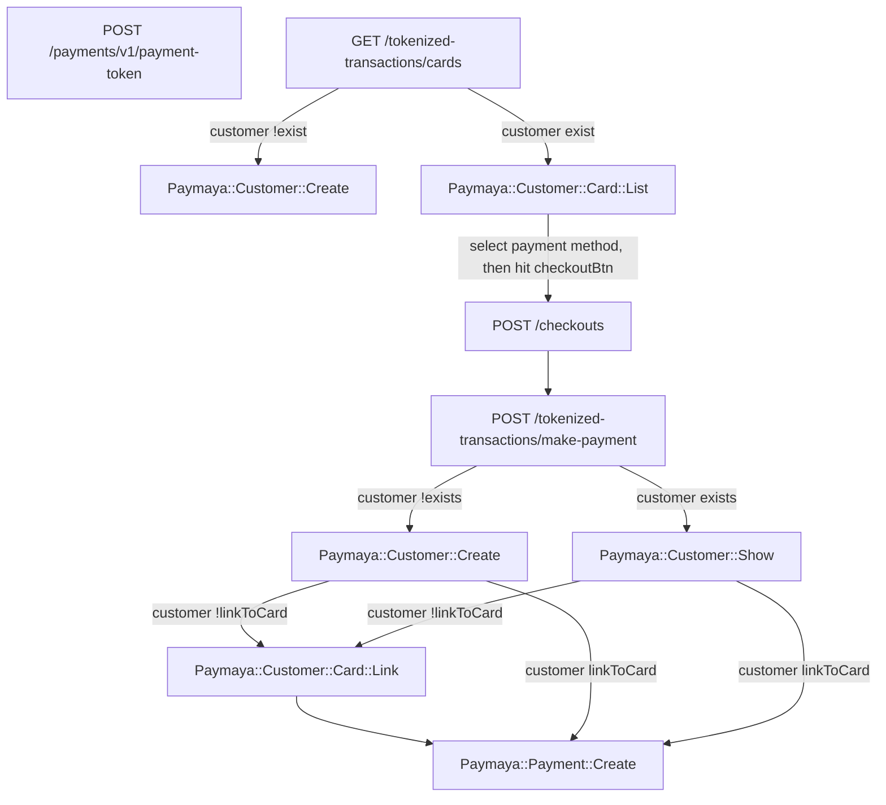

# Current Maya Payment Flow

```mermaid
---
title:
---
flowchart TB;
    A[POST /payments/v1/payment-token];
    B[GET /tokenized-transactions/cards]-- customer !exist -->C[Paymaya::Customer::Create];
    B-- customer exist -->D[Paymaya::Customer::Card::List];
    D-- select payment method, then hit checkoutBtn -->E[POST /checkouts];
    E-->F[POST /tokenized-transactions/make-payment];
    F-- customer !exists -->G[Paymaya::Customer::Create];
    G-- customer !linkToCard -->I[Paymaya::Customer::Card::Link];
    I-->J;
    G-- customer linkToCard -->J[Paymaya::Payment::Create];
    F-- customer exists -->H[Paymaya::Customer::Show];
    H-- customer !linkToCard -->I;
    H-- customer linkToCard -->J;
```
