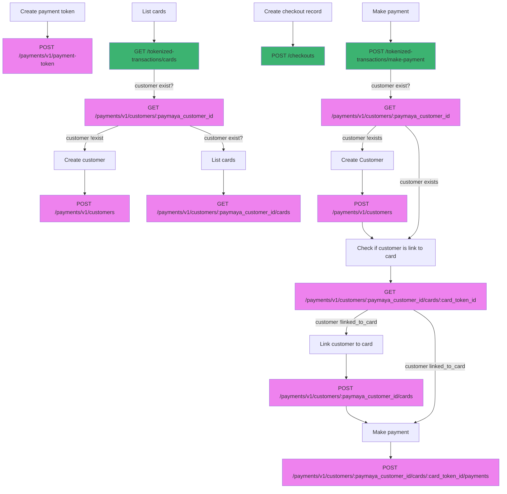

# Current Maya Payment Flow

```mermaid
---
title:
---
flowchart TB;
    style A1 fill:#ee82ee
    style B1 fill:#3cb371
    style E1 fill:#3cb371
    style F1 fill:#3cb371
    style F2 fill:#ee82ee
    style C fill:#ee82ee
    style D1 fill:#ee82ee
    style D3 fill:#ee82ee
    style G1 fill:#ee82ee
    style H0 fill:#ee82ee
    style H3 fill:#ee82ee
    style H4 fill:#ee82ee
    A0[Create payment token]-->A1[POST /payments/v1/payment-token];
    B0[List cards]-->B1[GET /tokenized-transactions/cards];
    B1-- customer exist? -->C[GET /payments/v1/customers/:paymaya_customer_id];
    C-- customer !exist -->D0[Create customer];
    D0-->D1[POST /payments/v1/customers];
    C-- customer exist? -->D2[List cards];
    D2-->D3[GET /payments/v1/customers/:paymaya_customer_id/cards]
    E0[Create checkout record]-->E1[POST /checkouts];
    FO[Make payment]-->F1[POST /tokenized-transactions/make-payment];
    F1-- customer exist? -->F2[GET /payments/v1/customers/:paymaya_customer_id];
    F2-- customer !exists -->G0[Create Customer];
    G0-->G1[POST /payments/v1/customers];
    G1-->G2[Check if customer is link to card];
    F2-- customer exists -->G2;
    G2-->H0[GET /payments/v1/customers/:paymaya_customer_id/cards/:card_token_id]
    H0-- customer !linked_to_card -->H1[Link customer to card];
    H1-->H4[POST /payments/v1/customers/:paymaya_customer_id/cards];
    H4-->H2;
    H0-- customer linked_to_card -->H2[Make payment];
    H2-->H3[POST /payments/v1/customers/:paymaya_customer_id/cards/:card_token_id/payments]
```
