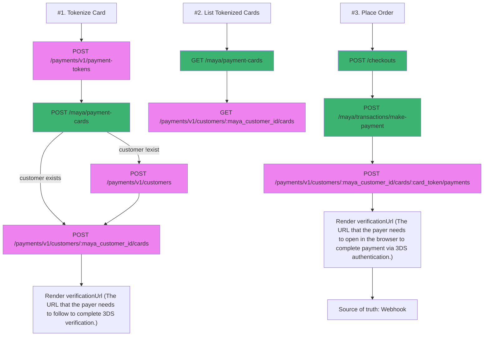

# Proposed Maya Payment Flow

```mermaid
---
title:
---
flowchart TB;
    style B1 fill:#ee82ee
    style B2 fill:#3cb371
    style F1 fill:#ee82ee
    style F2 fill:#ee82ee
    style Y fill:#3cb371
    style Z fill:#ee82ee
    style E fill:#3cb371
    style G fill:#3cb371
    style H fill:#ee82ee
    A["#1. Tokenize Card"]-->B1[POST /payments/v1/payment-tokens];
    B1-->B2[POST /maya/payment-cards];
    B2-- customer !exist -->F1[POST /payments/v1/customers];
    B2-- customer exists -->F2[POST /payments/v1/customers/:maya_customer_id/cards];
    F1-->F2;
    F2-->F3["Render verificationUrl (The URL that the payer needs to follow to complete 3DS verification.)"];
    X["#2. List Tokenized Cards"]-->Y[GET /maya/payment-cards];
    Y-->Z[GET /payments/v1/customers/:maya_customer_id/cards];
    C["#3. Place Order"];
    C-->E[POST /checkouts];
    E-->G[POST /maya/transactions/make-payment];
    G-->H[POST /payments/v1/customers/:maya_customer_id/cards/:card_token/payments];
    H-->I["Render verificationUrl (The URL that the payer needs to open in the browser to complete payment via 3DS authentication.)"];
    I-->J["Source of truth: Webhook"]
```
