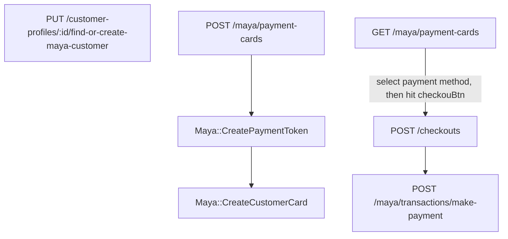

# Proposed Maya Payment Flow

```mermaid
---
title:
---
flowchart TB;
    A[PUT /customer-profiles/:id/find-or-create-maya-customer];
    B[POST /maya/payment-cards]-->F[Maya::CreatePaymentToken];
    F-->G[Maya::CreateCustomerCard];
    C[GET /maya/payment-cards];
    C-- select payment method, then hit checkouBtn -->D[POST /checkouts];
    D-->E[POST /maya/transactions/make-payment];
```
