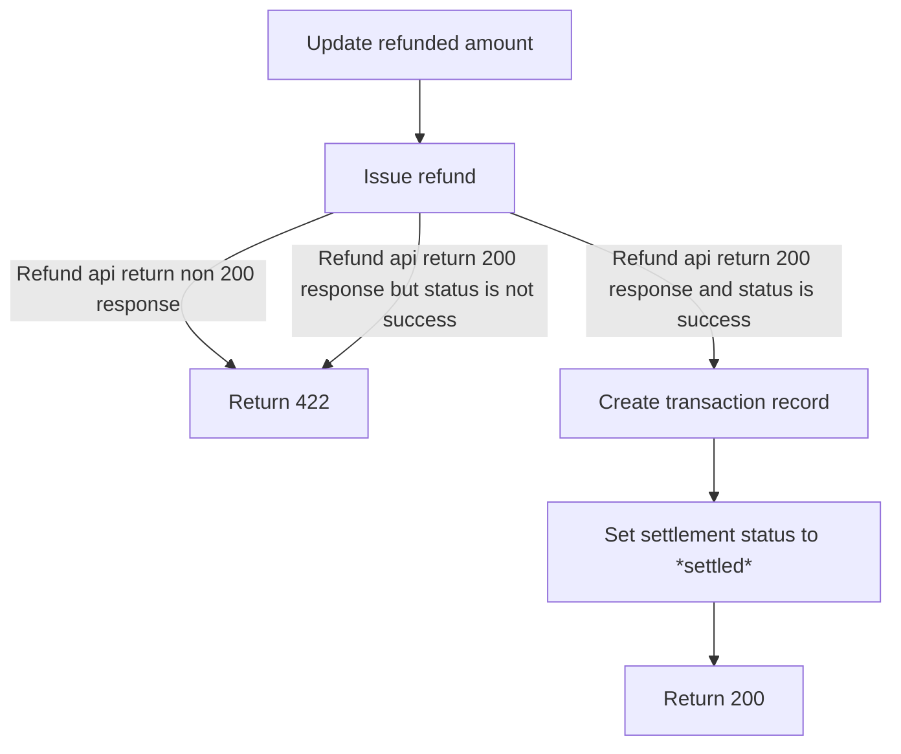

# Checkout settlement operations (Maya)

```mermaid
---
title:
---
flowchart TB;
    A[Update refunded amount]-->B[Issue refund];
    B-- Refund api return non 200 response -->C[Return 422]; 
    B-- Refund api return 200 response but status is not success -->C;
    B-- Refund api return 200 response and status is success -->D[Create transaction record];
    D-->E["Set settlement status to *settled*"];
    E-->F[Return 200];
```
