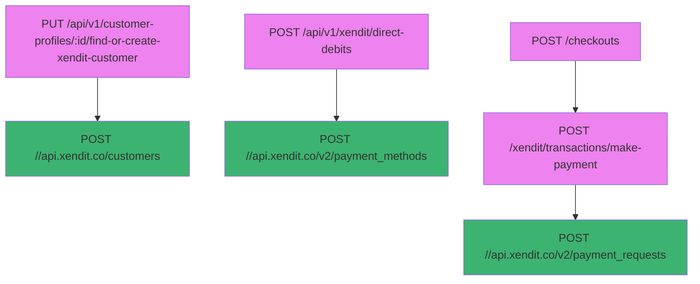

# Xendit Payment Flow

```mermaid
---
title:
---
flowchart TB;
    style A0 fill:#ee82ee
    style A1 fill:#3cb371
    style B0 fill:#ee82ee
    style B1 fill:#3cb371
    style C fill:#ee82ee
    style D0 fill:#ee82ee
    style D1 fill:#3cb371
    A0[PUT /api/v1/customer-profiles/:id/find-or-create-xendit-customer]-->A1[POST //api.xendit.co/customers];
    B0[POST /api/v1/xendit/direct-debits]-->B1[POST //api.xendit.co/v2/payment_methods];
    C[POST /checkouts]-->D0[POST /xendit/transactions/make-payment];
    D0-->D1[POST //api.xendit.co/v2/payment_requests];
```
