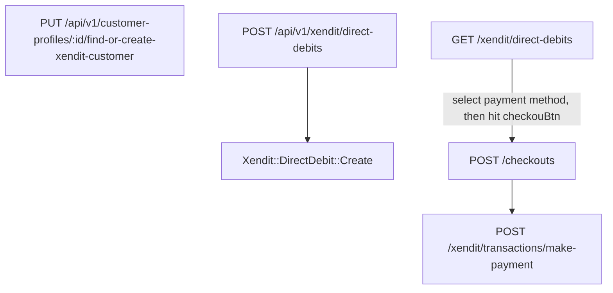

# Xendit Payment Flow

```mermaid
---
title:
---
flowchart TB;
    A[PUT /api/v1/customer-profiles/:id/find-or-create-xendit-customer];
    B[POST /api/v1/xendit/direct-debits]-->F[Xendit::DirectDebit::Create];
    C[GET /xendit/direct-debits];
    C-- select payment method, then hit checkouBtn -->D[POST /checkouts];
    D-->E[POST /xendit/transactions/make-payment];
```
